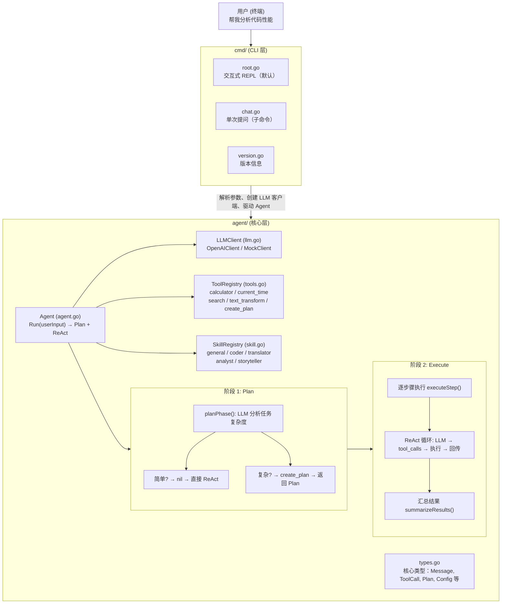
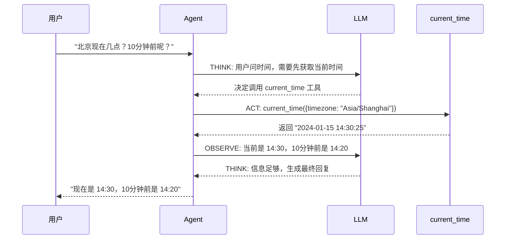
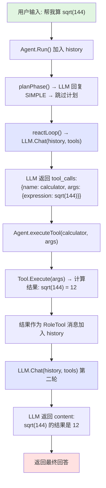

# 源码设计思路

## 项目定位

一个教学级 AI Agent 框架，用 Go 语言实现 **Plan + ReAct** 两阶段执行模式。目标是让开发者通过阅读源码理解 AI Agent 的核心原理，而非构建生产级系统。

## 整体架构



## 核心概念

### Plan + ReAct 两阶段执行

Agent 采用两阶段模式处理用户任务：

**阶段 1: Plan** — LLM 分析任务复杂度，复杂任务生成执行计划
**阶段 2: Execute** — 对计划中的每个步骤执行 ReAct 循环

简单任务跳过 Plan，直接进入 ReAct。

### ReAct 循环

ReAct = **Re**asoning + **Act**ing，是让 LLM 从"只能说"变成"能做"的关键范式。



关键洞察：LLM 不直接输出答案，而是输出 **"我想要做什么"**（tool_calls），Agent 框架执行后把结果喂回去，LLM 再决定下一步。

### Function Calling

Function Calling 是 LLM 与工具交互的协议：

1. 开发者定义工具的 JSON Schema（名称、描述、参数）
2. Schema 随请求发给 LLM
3. LLM 返回 `tool_calls` 而非文本（表示"我要调用这个工具"）
4. Agent 执行工具，把结果作为 `RoleTool` 消息放回对话
5. LLM 看到工具结果后继续推理

这就是 `agent/types.go` 中 `ToolDefinition`、`ToolCall`、`Message` 这些类型的用途。

### Skill 系统

Skill 是 Agent 的"人格切换"机制。每个 Skill 包含：
- **SystemPrompt**: 告诉 LLM 它现在是什么角色
- **Tools**: 该角色可用的工具列表（空 = 全部）

切换 Skill 会重置对话历史，让 Agent 以全新身份开始。

## 模块详解

### types.go — 类型基础

定义了整个 Agent 的数据结构：

| 类型 | 用途 |
|------|------|
| `Message` | 对话消息，对齐 OpenAI chat 格式 |
| `Role` | 消息角色：system / user / assistant / tool |
| `ToolCall` | LLM 请求调用的工具（ID + 函数名 + 参数） |
| `ToolDefinition` | 工具的 JSON Schema 描述（发给 LLM） |
| `Tool` | 完整工具 = Definition + Execute 函数 |
| `Plan` | 执行计划：Goal + Steps |
| `Step` | 计划步骤：ID + Description + Status |
| `Config` | Agent 配置：SystemPrompt + MaxTurns |

**设计决策**：所有类型直接对齐 OpenAI API 格式，避免额外转换层。

### llm.go — LLM 客户端

通过 `LLMClient` 接口抽象 LLM 调用：

```go
type LLMClient interface {
    Chat(messages []Message, tools []ToolDefinition) (*Message, error)
}
```

两种实现：
- **OpenAIClient**: 调用 `/v1/chat/completions`，兼容 OpenAI/Ollama/vLLM
- **MockClient**: 无需 API Key，按轮次模拟工具调用，用于教学演示

**设计决策**：用接口而非具体实现，让 Agent 与 LLM 解耦。替换后端只需实现 `Chat` 方法。

### tools.go — 工具系统

采用**注册表模式**管理工具：

```go
type ToolRegistry struct {
    tools map[string]Tool  // 名称 → 工具
}
```

内置 5 个工具：

| 工具 | 功能 | 参数 |
|------|------|------|
| `calculator` | 数学计算 | `expression: string` |
| `current_time` | 获取时间 | `timezone?: string` |
| `search` | 模拟搜索 | `query: string` |
| `text_transform` | 文本转换 | `text: string, operation: enum` |
| `create_plan` | 创建执行计划 | `goal: string, steps: []{description}` |

**设计决策**：注册表模式让工具可动态添加，LLM 通过 `Definitions()` 获取所有工具的 schema。

### skill.go — 技能系统

同样采用注册表模式：

```go
type SkillRegistry struct {
    skills map[string]Skill
}
```

内置 5 个技能：general、coder、translator、analyst、storyteller。

**设计决策**：Skill 只是配置（SystemPrompt + 工具列表），不含执行逻辑，保持简单。

### agent.go — 编排核心

Agent 是整个系统的中枢，组合了：
- `LLMClient`（大脑）
- `ToolRegistry`（手脚）
- `SkillRegistry`（人格）
- `history`（记忆）

`Run()` 方法实现 Plan + ReAct 两阶段执行：

| 方法 | 职责 |
|------|------|
| `Run(userInput)` | 主入口：Plan 阶段 → Execute 阶段 → 汇总结果 |
| `planPhase()` | 阶段 1：调用 LLM 判断任务复杂度，复杂任务生成 Plan |
| `parsePlanResponse()` | 解析 LLM 响应，判断是否创建计划 |
| `executeStep()` | 对单个计划步骤构建提示并调用 reactLoop |
| `reactLoop()` | ReAct 核心循环：LLM → 工具 → 结果回传 |
| `summarizeResults()` | 汇总所有步骤结果，生成最终答案 |

## 数据流

一次完整的 Agent 调用（简单任务，跳过 Plan）：



复杂任务会先经过 Plan 阶段生成执行计划，再逐步骤执行 ReAct 循环。

## 设计决策

### 1. 接口抽象 LLM

`LLMClient` 接口让 Agent 不依赖具体 LLM 实现。好处：
- 测试时可用 MockClient
- 切换后端（OpenAI → Ollama）零改动
- 未来可加 streaming、retry 等实现

### 2. 注册表模式

`ToolRegistry` 和 `SkillRegistry` 都用 map + Register/Get 模式。好处：
- 运行时动态注册
- 按名称查找 O(1)
- 便于扩展

### 3. 对齐 OpenAI 格式

所有消息类型直接兼容 OpenAI chat API。好处：
- 无需转换层
- 容易对接现有生态
- 教学时可直接对照 OpenAI 文档

### 4. Skill 作为配置而非继承

Skill 不是 Agent 的子类，只是一组配置。好处：
- 切换成本低（改 SystemPrompt + 过滤工具）
- 一个 Agent 可以有任意多 Skill
- 避免类继承的复杂性

## 扩展指南

### 添加新工具

在 `agent/tools.go` 的 `RegisterBuiltinTools()` 中添加：

```go
registry.Register(Tool{
    Definition: ToolDefinition{
        Type: "function",
        Function: FunctionSchema{
            Name:        "my_tool",
            Description: "工具描述（LLM 根据这个决定何时调用）",
            Parameters:  json.RawMessage(`{"type": "object", "properties": {...}}`),
        },
    },
    Execute: func(args json.RawMessage) (string, error) {
        // 解析参数、执行逻辑、返回结果
        return "result", nil
    },
})
```

### 添加新技能

在 `agent/skill.go` 的 `RegisterBuiltinSkills()` 中添加：

```go
registry.Register(Skill{
    Name:         "my_skill",
    Description:  "技能描述",
    SystemPrompt: "你是一个...",
    Tools:        []string{"calculator"}, // 空 = 全部工具
})
```

### 替换 LLM 后端

实现 `LLMClient` 接口即可：

```go
type MyClient struct{}

func (c *MyClient) Chat(messages []Message, tools []ToolDefinition) (*Message, error) {
    // 调用你的 LLM API
    return &Message{Role: RoleAssistant, Content: "reply"}, nil
}
```
