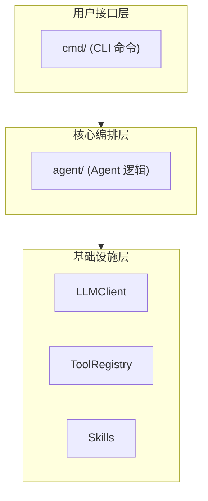
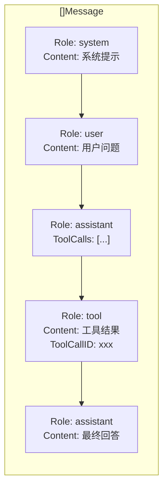
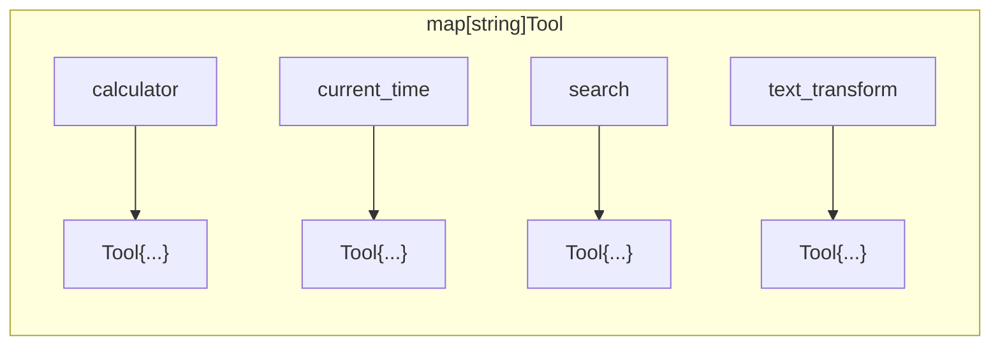
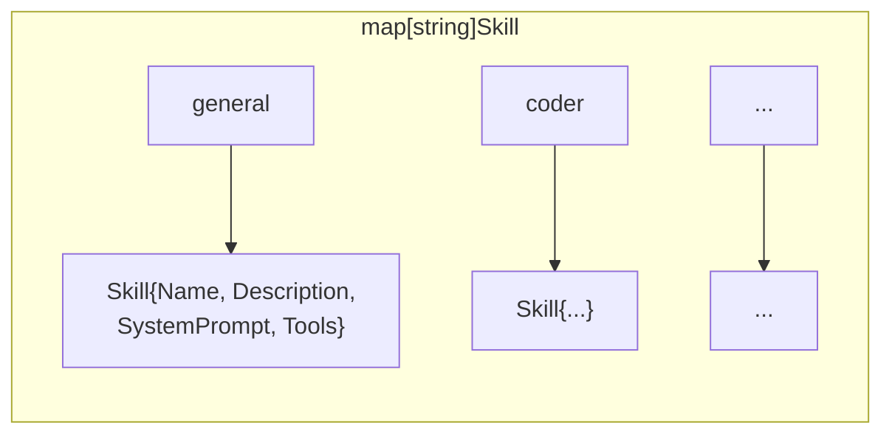
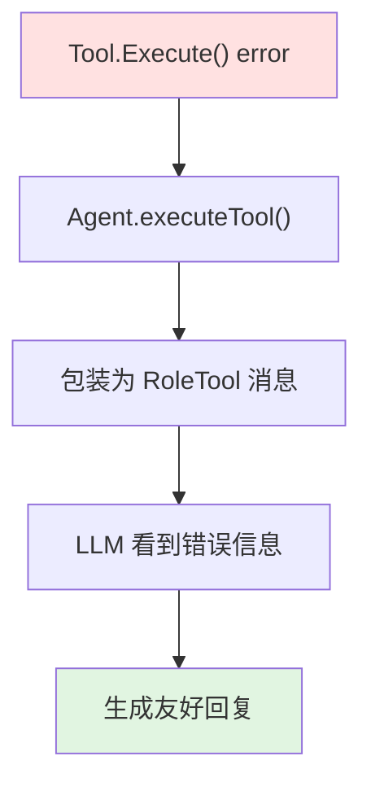

# 软件设计规格说明 (SDD)

## 1. 引言

### 1.1 目的

本文档定义 AI Agent 框架的软件设计规格，为开发、测试和维护提供技术依据。

### 1.2 范围

本规格适用于基于 ReAct 模式的教学级 AI Agent 框架，使用 Go 语言实现。

### 1.3 术语

| 术语 | 定义 |
|------|------|
| ReAct | Reasoning + Acting，LLM 推理与行动结合的范式 |
| Function Calling | LLM 与外部工具交互的协议 |
| Skill | Agent 的角色配置，包含系统提示和可用工具 |
| Tool | Agent 可调用的外部功能单元 |

## 2. 系统概述

### 2.1 系统定位

教学级 AI Agent 框架，演示 ReAct 模式的核心原理，适用于开发者学习和理解 AI Agent 架构。

### 2.2 核心能力

- 基于 ReAct 循环的智能对话
- 动态工具调用与结果处理
- 多角色技能切换
- 兼容 OpenAI API 格式

### 2.3 系统架构



## 3. 功能需求

### 3.1 用户接口

#### 3.1.1 交互式 REPL

- **描述**: 默认启动模式，提供交互式对话界面
- **输入**: 用户文本输入
- **输出**: Agent 文本响应
- **命令**:
  - `skills` - 列出可用技能
  - `skill <name>` - 切换技能
  - `exit` / `quit` - 退出程序

#### 3.1.2 单次提问模式

- **描述**: 通过 `chat` 子命令执行单次提问
- **格式**: `./ai-agent chat "问题内容"`
- **输出**: 直接返回回答并退出

### 3.2 Agent 核心

#### 3.2.1 ReAct 循环

- **输入**: 用户消息 + 工具定义列表
- **处理**:
  1. 将用户消息加入对话历史
  2. 调用 LLM 获取响应
  3. 若响应包含 tool_calls → 执行工具 → 结果加入历史 → 返回步骤 2
  4. 若响应为文本 → 返回最终答案
- **约束**: 最大循环次数 = 10

#### 3.2.2 工具执行

- **输入**: 工具名称 + JSON 参数
- **输出**: 执行结果字符串
- **错误处理**: 工具不存在或执行失败时返回错误信息

### 3.3 工具系统

#### 3.3.1 内置工具

| 工具名 | 功能 | 参数 | 返回值 |
|--------|------|------|--------|
| `calculator` | 数学计算 | `expression: string` | 计算结果 |
| `current_time` | 获取当前时间 | `timezone?: string` | 时间字符串 |
| `search` | 模拟搜索 | `query: string` | 搜索结果 |
| `text_transform` | 文本转换 | `text: string, operation: enum` | 转换后文本 |

#### 3.3.2 工具注册

- 支持运行时动态注册
- 工具定义包含: 名称、描述、参数 Schema、执行函数

### 3.4 技能系统

#### 3.4.1 内置技能

| 技能名 | 描述 | 系统提示 | 可用工具 |
|--------|------|----------|----------|
| `general` | 通用助手 | 默认提示 | 全部 |
| `coder` | 代码助手 | 编程相关提示 | 全部 |
| `translator` | 翻译官 | 翻译相关提示 | 全部 |
| `analyst` | 数据分析师 | 分析相关提示 | 全部 |
| `storyteller` | 故事大王 | 创作相关提示 | 全部 |

#### 3.4.2 技能切换

- 切换时重置对话历史
- 更新系统提示
- 可选: 过滤可用工具列表

## 4. 非功能需求

### 4.1 性能要求

- 单次对话响应时间 < 30 秒（受 LLM API 限制）
- 工具执行时间 < 1 秒（本地计算）

### 4.2 可靠性

- LLM API 调用失败时返回友好错误信息
- 工具执行异常不导致程序崩溃

### 4.3 可扩展性

- 支持动态注册新工具
- 支持动态注册新技能
- 支持替换 LLM 后端实现

### 4.4 兼容性

- 兼容 OpenAI API 格式
- 支持 OpenAI / Ollama / vLLM 等后端

## 5. 接口规范

### 5.1 LLMClient 接口

```go
type LLMClient interface {
    Chat(messages []Message, tools []ToolDefinition) (*Message, error)
}
```

**输入**:
- `messages`: 对话历史列表
- `tools`: 工具定义列表

**输出**:
- `*Message`: LLM 响应消息
- `error`: 调用错误

### 5.2 Tool 接口

```go
type Tool struct {
    Definition ToolDefinition
    Execute    func(args json.RawMessage) (string, error)
}
```

**Definition**:
- `Type`: 固定为 "function"
- `Function.Name`: 工具名称
- `Function.Description`: 工具描述
- `Function.Parameters`: JSON Schema

**Execute**:
- 输入: JSON 格式参数
- 输出: 结果字符串 + 错误

### 5.3 Message 类型

```go
type Message struct {
    Role       Role
    Content    string
    ToolCalls  []ToolCall
    ToolCallID string
}
```

**Role 枚举**:
- `system` - 系统提示
- `user` - 用户消息
- `assistant` - Agent 响应
- `tool` - 工具结果

## 6. 数据模型

### 6.1 对话历史



### 6.2 工具注册表



### 6.3 技能注册表



## 7. 约束条件

### 7.1 技术约束

- 语言: Go 1.21+
- 依赖: cobra (CLI), 标准库
- 无外部数据库依赖

### 7.2 运行约束

- 需要有效的 LLM API Key（Mock 模式除外）
- 网络连接（调用远程 LLM 时）

### 7.3 安全约束

- API Key 不硬编码在代码中
- 工具执行在受限环境（当前为直接执行）

## 8. 错误处理

### 8.1 错误类型

| 错误场景 | 处理方式 |
|----------|----------|
| LLM API 调用失败 | 返回错误信息，终止对话 |
| 工具不存在 | 返回 "tool not found" 错误 |
| 工具执行失败 | 返回工具错误信息给 LLM |
| JSON 解析失败 | 返回解析错误信息 |
| 达到最大循环次数 | 返回当前对话结果 |

### 8.2 错误传播



## 9. 测试策略

### 9.1 单元测试

- LLMClient 接口测试（使用 MockClient）
- ToolRegistry 注册/获取测试
- SkillRegistry 注册/获取测试

### 9.2 集成测试

- Agent 完整 ReAct 循环测试
- 多轮对话测试
- 技能切换测试

### 9.3 端到端测试

- CLI 命令测试
- 交互式 REPL 测试

## 10. 部署规格

### 10.1 构建

```bash
go build -o ai-agent .
```

### 10.2 运行

```bash
# 交互模式
./ai-agent

# 单次提问
./ai-agent chat "问题"

# 指定 LLM
./ai-agent --api-key sk-xxx --model gpt-4o
```

### 10.3 环境变量

| 变量 | 描述 | 默认值 |
|------|------|--------|
| `OPENAI_API_KEY` | API Key | 无 |
| `OPENAI_BASE_URL` | API 地址 | `https://api.openai.com/v1` |

## 附录 A: 变更记录

| 版本 | 日期 | 变更描述 |
|------|------|----------|
| 1.0 | 2024-01 | 初始版本 |
